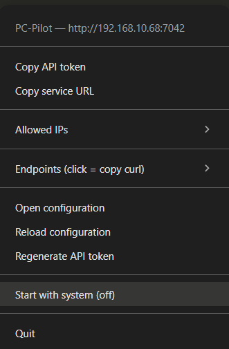
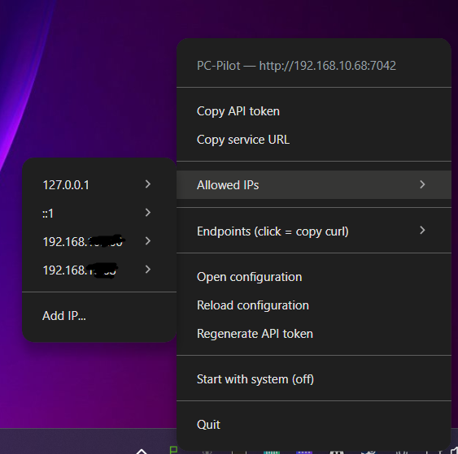
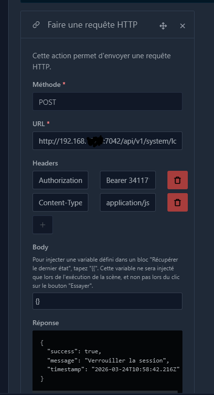
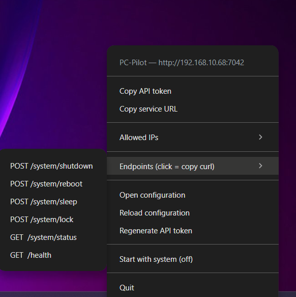

# PC-Pilot

Control your PC from your home automation system — shut down, reboot, sleep, lock, launch apps, and more.

Built for [Gladys Assistant](https://gladysassistant.com). Works with any system that can send HTTP requests.



## Quick start

### 1. Install and launch

Download the installer from the [Releases](https://github.com/david-digitis/pc-pilot/releases) page and run it.

PC-Pilot starts in your system tray (bottom-right of your taskbar). Right-click the green **P** icon to access the menu.

### 2. Allow your home automation system's IP

Your home automation system needs permission to talk to PC-Pilot.

Right-click the tray icon > **Allowed IPs** > **Add IP...** and enter the IP address of your Gladys (or other system).



### 3. Open the port in your firewall

If your home automation system is on a different machine (which it usually is), you need to allow incoming connections on port 7042.

On Windows, open a terminal as Administrator and run:

```bash
netsh advfirewall firewall add rule name="PC-Pilot" dir=in action=allow protocol=TCP localport=7042
```

### 4. Get your API token

Right-click the tray icon > **Copy API token**. You'll need it to authenticate requests.

### 5. Set up a scene in Gladys

In Gladys, create a scene with the action **Make an HTTP request**:

- **Method**: `POST`
- **URL**: `http://<your-pc-ip>:7042/api/v1/system/lock`
- **Headers**:
  - `Authorization` = `Bearer <your-token>`
  - `Content-Type` = `application/json`
- **Body**: `{}`

> **Note**: the `{}` body is required even for commands that don't need one.



Replace `/system/lock` with any command from the list below.

## Available commands

| Action | URL path | What it does |
| ------ | -------- | ------------ |
| Shut down | `/api/v1/system/shutdown` | Shuts down the PC (5 second delay) |
| Reboot | `/api/v1/system/reboot` | Restarts the PC |
| Sleep | `/api/v1/system/sleep` | Puts the PC to sleep |
| Hibernate | `/api/v1/system/hibernate` | Hibernates the PC |
| Lock | `/api/v1/system/lock` | Locks the session |
| System status | `/api/v1/system/status` | Returns uptime, RAM, CPU info (GET) |
| Health check | `/api/v1/health` | Check if PC-Pilot is running (GET, no auth needed) |

## Tray menu

Everything is managed from the tray icon — no config file editing required for basic usage.



| Menu item | What it does |
| --------- | ------------ |
| **Copy API token** | Copies the token to your clipboard |
| **Copy service URL** | Copies the base URL (e.g. `http://192.168.1.100:7042`) |
| **Allowed IPs** | Add or remove IPs that can access the API |
| **Endpoints** | Click any endpoint to copy a ready-to-use curl command |
| **Open configuration** | Opens the config file for advanced settings |
| **Reload configuration** | Reloads config without restarting |
| **Regenerate API token** | Creates a new token (invalidates the old one) |
| **Start with system** | Toggle auto-start on login |

## Scene examples for Gladys

**"Turn off the PC" by voice:**

| Field | Value |
| ----- | ----- |
| Method | `POST` |
| URL | `http://<pc-ip>:7042/api/v1/system/shutdown` |
| Header | `Authorization` = `Bearer <token>` |
| Header | `Content-Type` = `application/json` |
| Body | `{}` |

**Lock PC when leaving home:**

Same as above, but with URL: `http://<pc-ip>:7042/api/v1/system/lock`

**Wake up a specific app:**

| Field | Value |
| ----- | ----- |
| Method | `POST` |
| URL | `http://<pc-ip>:7042/api/v1/apps/launch` |
| Header | `Authorization` = `Bearer <token>` |
| Header | `Content-Type` = `application/json` |
| Body | `{ "id": "firefox" }` |

> Apps must be configured in the config file first — see the Advanced section below.

---

## Advanced configuration

The config file is located at:

- **Windows**: `%APPDATA%\pc-pilot\config.json`
- **Linux**: `~/.config/pc-pilot/config.json`

You can open it from the tray menu > **Open configuration**. Changes are detected automatically.

### Adding apps

Add entries to the `apps` array to launch/kill applications via the API:

```json
{
  "apps": [
    {
      "id": "firefox",
      "label": "Firefox",
      "path": {
        "win32": "C:\\Program Files\\Mozilla Firefox\\firefox.exe",
        "linux": "/usr/bin/firefox"
      }
    },
    {
      "id": "vlc",
      "label": "VLC",
      "path": {
        "win32": "C:\\Program Files\\VideoLAN\\VLC\\vlc.exe",
        "linux": "/usr/bin/vlc"
      }
    }
  ]
}
```

### Adding custom commands

Add entries to the `commands` array to run scripts or tools:

```json
{
  "commands": [
    {
      "id": "backup-nas",
      "label": "Backup to NAS",
      "command": { "win32": "robocopy", "linux": "rsync" },
      "args": {
        "win32": ["C:\\Users\\David\\Documents", "\\\\NAS\\backup"],
        "linux": ["-avz", "~/Documents/", "nas:/backup/"]
      },
      "timeout": 300000
    }
  ]
}
```

Then call them with `POST /api/v1/commands/execute` and body `{ "id": "backup-nas" }`.

### Full API reference

All routes require the `Authorization: Bearer <token>` header unless noted.

#### System

| Method | Endpoint | Description |
| ------ | -------- | ----------- |
| POST | `/api/v1/system/shutdown` | Shut down (5s delay) |
| POST | `/api/v1/system/reboot` | Reboot |
| POST | `/api/v1/system/sleep` | Sleep |
| POST | `/api/v1/system/hibernate` | Hibernate |
| POST | `/api/v1/system/lock` | Lock session |
| GET | `/api/v1/system/status` | System info |

#### Applications

| Method | Endpoint | Body | Description |
| ------ | -------- | ---- | ----------- |
| POST | `/api/v1/apps/launch` | `{ "id": "..." }` | Launch an app |
| POST | `/api/v1/apps/kill` | `{ "id": "..." }` | Kill an app |
| GET | `/api/v1/apps/registered` | — | List configured apps |

#### Custom commands

| Method | Endpoint | Body | Description |
| ------ | -------- | ---- | ----------- |
| POST | `/api/v1/commands/execute` | `{ "id": "..." }` | Run a command |
| GET | `/api/v1/commands/list` | — | List commands |

#### Meta

| Method | Endpoint | Auth | Description |
| ------ | -------- | ---- | ----------- |
| GET | `/api/v1/health` | No | Health check |
| GET | `/api/v1/endpoints` | Yes | All endpoints with curl examples |

## Security

PC-Pilot is designed to run on a local network. It is **not** meant to be exposed to the internet.

- **API token**: 256-bit, constant-time comparison to prevent timing attacks
- **IP whitelist**: only IPs you explicitly allow can reach the API
- **Command whitelist**: the API only accepts identifiers, never raw shell commands
- **No shell execution**: all commands use `execFile` with `shell: false`
- **Rate limiting**: 30 requests/minute per IP
- **No CORS**: prevents browser-based attacks from other websites

## Development

```bash
git clone https://github.com/david-digitis/pc-pilot.git
cd pc-pilot
npm install
npm start
```

### Build

```bash
npm run build:win      # Windows .exe installer
npm run build:linux    # Linux .AppImage
```

### Tech stack

- Node.js 22 LTS / Fastify 5 / Electron (tray-only) / pino logger

## License

MIT — [Digitis](https://digitis.cloud)
